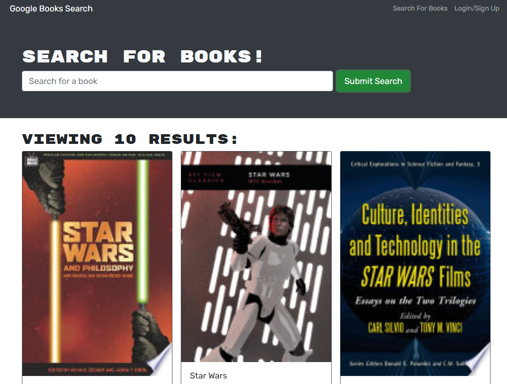

# Book Search MERN and GraphQL

## Description

Google Books API search engine. The app was built using the MERN stack, with a React front end, MongoDB database, and Node.js/Express.js server and API.

## Live URL

https://blooming-anchorage-74224.herokuapp.com/

## Screenshot

